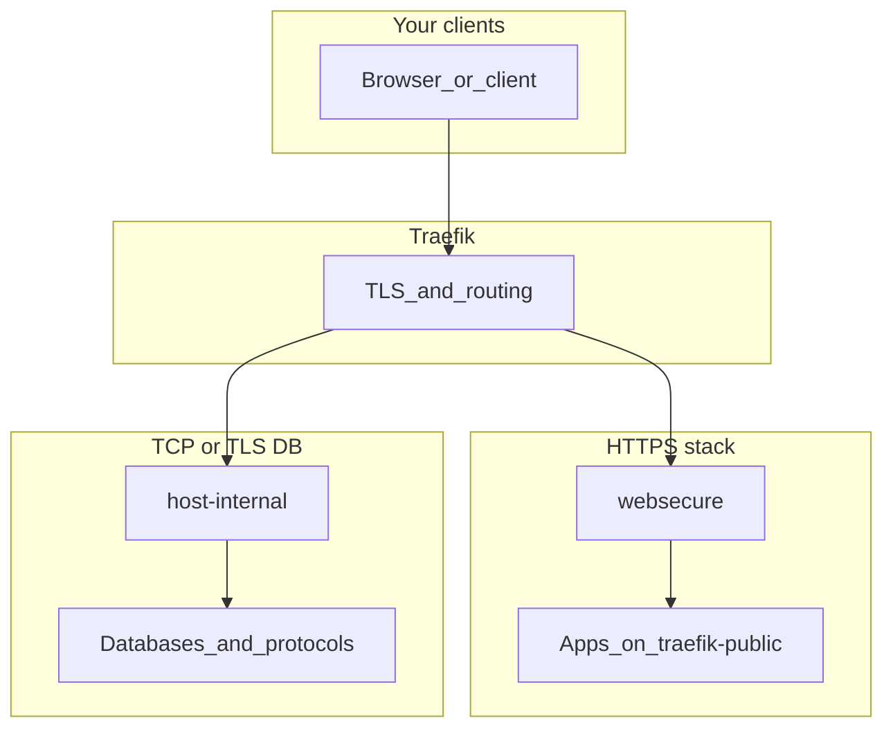

# Homelab Compose

### Multi-stack infrastructure for a serious homelab

*Docker Swarm at the core · Traefik edge · optional Kubernetes (K3s) alongside*

[](LICENSE)
[](https://github.com/FarDust/homelab-stack/actions/workflows/validate-compose.yml)
[](https://github.com/FarDust/homelab-stack/actions/workflows/pre-commit.yml)

**[AGENTS.md](AGENTS.md)** (conventions, deploy, secrets, commits) · **[stacks/main/README.md](stacks/main/README.md)** (Traefik, networks, entrypoints)

## Table of contents

- [What this repository is](#what-this-repository-is)
- [Architecture at a glance](#architecture-at-a-glance)
- [Repository layout](#repository-layout)
- [Deploy and naming](#deploy-and-naming)
- [Security and access](#security-and-access)
- [Prerequisites and DNS](#prerequisites-and-dns)
- [Observability and backups](#observability-and-backups)
- [Continuous integration](#continuous-integration)
- [Documentation index](#documentation-index)
- [Quick sanity checks](#quick-sanity-checks)
- [Clone](#clone)
- [License and disclaimer](#license-and-disclaimer)

---

## 🏠 What this repository is

This is a **large, multi-stack infrastructure repository**, not a single application. It models a full homelab in **declarative Compose** for **Docker Swarm**: reverse proxy and TLS, authentication, databases and object storage, metrics and logs, uptime surfaces, security tooling, cross-cluster bridges, and many optional domains (admin, apps, productivity, hobby, retrieval/RAG, devtools, compute, …). **[`clusters/`](clusters/)** adds **K3s** (and related) definitions that sit **next to** Swarm, not instead of it.

**Day-to-day operations** use a root **`.env`**, **`CONFIG_VERSION`** when Swarm configs change, and **`uv run cluster-utils deploy`** (details in AGENTS.md). The tree assumes **real cluster semantics**: placement labels, overlay networks, replicas, not a single throwaway VM.

---

## 🧱 Architecture at a glance

Traefik sits at the **edge**: TLS termination and routing by hostname. **HTTP(S)** workloads use **`websecure`** and `Host()` (often on **`traefik-public`**). **Native protocols** (PostgreSQL, Redis, MongoDB, …) use **`host-internal`** and **`HostSNI()`** on the **`traefik`** network. Full tables and label patterns live in [stacks/main/README.md](stacks/main/README.md).



---

## 📁 Repository layout

| Area | Role |
|------|------|
| [`stacks/main/`](stacks/main/) | **Core plane**: Traefik, Authelia, storage, monitoring, logging, uptime, maintenance (rclone fixer), bridges, security, identity → [stacks/main/README.md](stacks/main/README.md) |
| Other [`stacks/*`](stacks/) | **Optional domains**: admin, apps, productivity, hobby, retrieval, llms, ml, security, devtools, compute, vision (each has a README; see index below) |
| [`clusters/`](clusters/) | **K3s** and cluster-side automation → [clusters/main/k3s/README.md](clusters/main/k3s/README.md) |
| [`services/`](services/) | Shared snippets |
| [`secrets/`](secrets/) | Secret **files** (gitignored); see AGENTS.md |

**Stack boundaries:** What may live under each `stacks/<name>/` tree (and when to add a new compose file there) is written in **that folder’s README**. Shared mechanics only (naming, Traefik patterns, secrets) stay in [AGENTS.md](AGENTS.md).

---

## 🚀 Deploy and naming

Stack names follow **`folder-filename`** (see AGENTS.md). Example: [`stacks/main/traefik.yml`](stacks/main/traefik.yml) → **`main-traefik`**.

| Compose file | Swarm stack name |
|--------------|------------------|
| [`stacks/main/traefik.yml`](stacks/main/traefik.yml) | `main-traefik` |
| [`stacks/main/storage.yml`](stacks/main/storage.yml) | `main-storage` |
| [`stacks/admin/dashboards.yml`](stacks/admin/dashboards.yml) | `admin-dashboards` |

**Deploy flow**

1. `set -a; source .env; set +a` to load `CONFIG_VERSION`, `LOCAL_DOMAIN`, `DOMAIN_NAME`, …
2. `uv run cluster-utils deploy --help` to deploy stacks; see AGENTS.md for detach quirks (e.g. Traefik).

If Swarm complains about **config** conflicts, bump **`CONFIG_VERSION`** in `.env` (AGENTS.md).

---

## 🔐 Security and access

Designed for **trusted networks** (VPN, tailnet, private LAN), not anonymous internet exposure. Hostnames use **`${LOCAL_DOMAIN}`** or **`${DOMAIN_NAME}`** when you intentionally use public DNS.

| Kind | Entrypoint | Typical network |
|------|------------|-------------------|
| Web UIs & HTTP APIs | `websecure` | `traefik-public` |
| Postgres, Redis, MongoDB, … | `host-internal` | `traefik` |

More detail: [stacks/main/README.md](stacks/main/README.md) (including **monitoring vs uptime**).

---

## 📋 Prerequisites and DNS

- **Docker Swarm** on managers
- Root **`.env`** ([`.env.example`](.env.example) as a starting point)
- **`secrets/`** per stack (AGENTS.md)
- **Cloudflare** token files for ACME (below)

Optional: **Tailscale** + **split DNS** so `${LOCAL_DOMAIN}` resolves for you.

### Cloudflare DNS and Let’s Encrypt (Traefik)

[`stacks/main/traefik.yml`](stacks/main/traefik.yml) uses resolver **`le-dns`**, **DNS-01**, provider **`cloudflare`**, which suits **wildcards** and names that are not reachable on **:80** from the public internet.

| Token | Scope (typical) | Purpose |
|-------|-----------------|--------|
| **DNS** | Zone → DNS → Edit | ACME `_acme-challenge` TXT |
| **Zone** | Zone → Zone → Read | Zone metadata |

Files:

- `secrets/cloudflare/dns_api_token`
- `secrets/cloudflare/zone_api_token`

Routers use `tls.certresolver=le-dns` where set; see [stacks/main/README.md](stacks/main/README.md).

### Dynamic public IP (optional)

If your **uplink IP changes** but you still need a **public** name (ACME or rare public endpoints), use DDNS (for example **[FreeMyIP](https://freemyip.com/)** with Cloudflare, **DuckDNS**, **ddclient**, or Cloudflare API scripts). Short propagation delays are normal. Often public DNS is only for **certificates**, while users stay on **Tailscale** or internal DNS.

---

## 📊 Observability and backups

| Concern | Where to look |
|---------|----------------|
| Metrics, logs, Grafana stack | [`stacks/main/monitoring.yml`](stacks/main/monitoring.yml), [`stacks/main/logging.yml`](stacks/main/logging.yml) |
| Operator-facing **uptime** | [`stacks/main/uptime.yml`](stacks/main/uptime.yml) |
| **Monitoring vs uptime** semantics | [stacks/main/README.md](stacks/main/README.md) |

**Backups** are yours to define (DB dumps, snapshots, object storage). Maintenance includes **rclone** automation; recovery notes: [docs/troubleshoot/rclone.md](docs/troubleshoot/rclone.md), [stacks/main/configs/rclone/README.md](stacks/main/configs/rclone/README.md).

---

## ✅ Continuous integration

| Workflow | Role |
|----------|------|
| [`validate-compose.yml`](.github/workflows/validate-compose.yml) | Render / validate compose |
| [`pre-commit.yml`](.github/workflows/pre-commit.yml) | Hooks on push/PR |
| `check-*.yml` | Deeper checks (invoked from validate) |

> [!NOTE]
> [`deploy.yml`](.github/workflows/deploy.yml) and [`services.yml`](.github/workflows/services.yml) are **deprecated** (no push to `main`). Deploy with **`uv run cluster-utils deploy`** from your machine or CI you control.

---

## 📚 Documentation index

| README | Scope |
|--------|--------|
| [stacks/admin/README.md](stacks/admin/README.md) | Admin dashboards |
| [stacks/apps/README.md](stacks/apps/README.md) | Apps (Supabase, web); submodule note |
| [stacks/compute/README.md](stacks/compute/README.md) | Compute / execution |
| [stacks/devtools/README.md](stacks/devtools/README.md) | Devtools |
| [stacks/hobby/README.md](stacks/hobby/README.md) | Hobby / media / IoT |
| [stacks/llms/README.md](stacks/llms/README.md) | AI and LLM-related compose (agents, MCP, monitoring) |
| [stacks/main/README.md](stacks/main/README.md) | Traefik, networks, `main-*` stacks |
| [stacks/ml/README.md](stacks/ml/README.md) | ML orchestration (Metaflow) |
| [stacks/productivity/README.md](stacks/productivity/README.md) | Productivity |
| [stacks/retrieval/README.md](stacks/retrieval/README.md) | Retrieval / analytics |
| [stacks/security/README.md](stacks/security/README.md) | Security |
| [stacks/vision/README.md](stacks/vision/README.md) | Image generation (ComfyUI) |
| [clusters/main/k3s/README.md](clusters/main/k3s/README.md) | K3s |

**More in `docs/`:** [node-labels.md](docs/node-labels.md) · [redis-db-ids.md](docs/redis-db-ids.md) · [troubleshoot/rclone.md](docs/troubleshoot/rclone.md)

---

## 🧪 Quick sanity checks

Use hostnames from your Traefik labels (`dashboard` uses **`${LOCAL_DOMAIN}`**; Grafana uses **`${DOMAIN_NAME}`** in [`stacks/main/traefik.yml`](stacks/main/traefik.yml)):

```bash
curl -kI "https://dashboard.${LOCAL_DOMAIN}/ping"
curl -kI "https://grafana.${DOMAIN_NAME}/api/health"
docker service ls
```

---

## 📥 Clone

```bash
git clone git@github.com:FarDust/homelab-stack.git
cd homelab-stack
```

---

## License and disclaimer

Configuration here is under the [LICENSE](LICENSE) (**MIT**) where it applies. **Third-party images** keep their own licenses. **Personal homelab** use: you are responsible for compliance, backups, and security.
