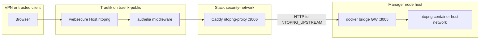

# Security Stack

This directory contains network and security infrastructure services for the Docker Swarm cluster.

## Scope (what belongs in `stacks/security/`)

- **Belongs here:** **Network and perimeter-adjacent** controls that complement the Traefik stack in [`stacks/main/traefik.yml`](../main/traefik.yml): dedicated **DNS** stacks, **network analytics** (e.g. Redis + ntopng proxy), and **vendor tunnels** (e.g. Cloudflare) in separate compose files.
- **Add a compose file here** when the service is **security or DNS policy** for the LAN/cluster, or a **narrow tunnel**, and you want it isolated from the main Traefik compose file.

## Services Overview

- **network.yml**: `security-redis` (Redis, TCP via `host-internal`), `ntopng-proxy` (Caddy in front of ntopng on the Docker host). See [ntopng proxy wiring](#ntopng-proxy-wiring-swarm--host) below and the compose file for Traefik labels and secrets.
- **dns.yml**: DNS infrastructure and privacy (Pi-hole, DNSCrypt, DNSCrypt-Proxy).
- **vendor.yml**: Cloudflare tunnel (`cloudflared`) for **n8n** (`cloudflared-n8n` service; `CLOUDFLARE_N8N_TUNNEL_TOKEN`).

## Architecture Philosophy

- **Separation of Concerns**: Security and network services are isolated from core infrastructure and user-facing apps.
- **No Sensitive Data in Git**: All secrets (passwords, API keys, etc.) are referenced via Docker secrets and never committed to git.
- **Role-Oriented**: Each file is focused on a specific security or network function, avoiding catch-alls.

## Security Notes

- All secrets are stored in `../../secrets/` and referenced securely.
- No sensitive data is present in this repository.
- Network segmentation and TLS are enforced for services where Traefik terminates TLS.

## File Structure

```
stacks/security/
├── network.yml   # Redis + ntopng proxy
├── dns.yml       # DNS infrastructure and privacy
├── vendor.yml    # Cloudflare tunnel
└── README.md     # This documentation
```

## ntopng proxy wiring (Swarm + host)

**Two moving parts:** ntopng’s **UI and capture** run from a **non-Swarm** compose file ([`services/security/network.yml`](../../services/security/network.yml)) with `network_mode: host` and `--http-port` set so the process listens on **`${HOST_DOCKER_GW}:3005`** (see [`.env.example`](../../.env.example) for `HOST_DOCKER_GW`, typically the docker bridge gateway on the host). The **Swarm** service **`ntopng-proxy`** is **Caddy** ([`network.yml`](network.yml)): Traefik terminates TLS and applies **Authelia**, then forwards to Caddy on port **3006**; Caddy’s [Caddyfile](configs/ntopng/Caddyfile) reverse-proxies to **`${HOST_DOCKER_GW}:3005`**.



**Placement:** `ntopng-proxy` is **global** with **`node.role == manager`**, so each manager runs a Caddy task that can reach **that node’s** `HOST_DOCKER_GW:3005`. Run the host **ntopng** compose on the **same** manager(s) where you expect the UI to work (or adjust upstream addressing).

**Data / exports:** The host ntopng service can stream flows to **ClickHouse** using `-F` in [`services/security/network.yml`](../../services/security/network.yml) (TCP to your core ClickHouse router; see that file and `.env`).

**Health check:** If Caddy is up but ntopng is down, HTTPS may load but you get **502** from the proxy. Example checks:

```bash
docker service ls --filter name=security-network
docker service ps security-network_ntopng-proxy --no-trunc
docker ps -a --filter name=ntopng
```

## Deploy

Swarm stack names follow `security-<filename>`: **`security-network`**, **`security-dns`**, **`security-vendor`**. From the repo root: `set -a; source .env; set +a` then `uv run cluster-utils deploy --help` (see [AGENTS.md](../../AGENTS.md)).

Start or restart **host** ntopng separately, from the directory that contains [`services/security/network.yml`](../../services/security/network.yml), for example:

```bash
docker compose -f services/security/network.yml up -d
```
